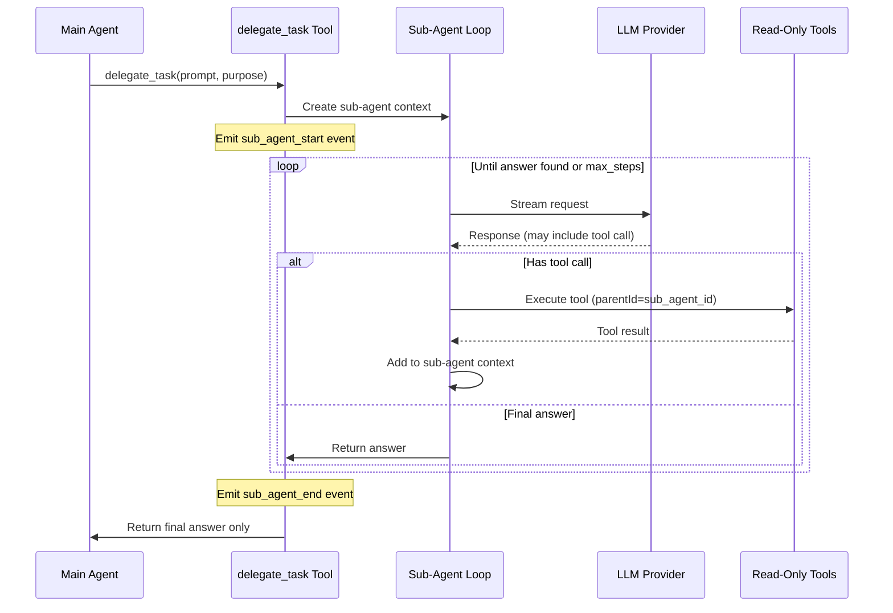

# Sub-Agent Tool Implementation

## Overview

Add a `delegate_task` system tool that spawns a sub-agent for research/information-finding tasks. The sub-agent operates in isolation with its own context, executes multi-turn tool calls, and returns only the final answer to the main agent. All sub-agent activity is stored in the chat for debugging with a recursive inspector UI.

## Key Design Decisions

### Tool Naming

Use `delegate_task` (alternative: `ask_specialist`) - clearer for LLMs to understand this delegates work to a specialized helper that will research and return findings.

### Context Isolation

- Sub-agent has its own message history (not polluting main context)
- Only the final answer/result is returned to the main agent's context
- Main agent sees: `delegate_task` tool call -> result summary

### Hierarchical Events

All sub-agent trace events use `parentId` to link to the parent `sub_agent_start` event, enabling:

- Recursive UI rendering
- Proper grouping in debug view
- Clean separation of main vs sub-agent activity

## Architecture



## Server Implementation

### 1. Add Tool Description (`[server/tools/descriptions.py](server/tools/descriptions.py)`)

Add to `TOOL_DESCRIPTIONS`:

```python
"delegate_task": {
    "description": "Delegate a research or information-finding task to a specialized sub-agent. Use this when you need to find specific code, understand how something works, or gather information that may require multiple file reads and searches. The sub-agent will investigate autonomously and return only the final answer, keeping your main context clean. Best for: finding where code is located, understanding implementations, gathering context before making changes.",
    "parameters": {
        "task": {
            "type": "string",
            "required": True,
            "description": "A detailed description of what information to find or research. Be specific about what you need to know.",
        },
        "purpose": {
            "type": "string",
            "required": False,
            "description": "Brief context about why you need this information (helps sub-agent focus).",
        },
    },
}
```

### 2. Implement Sub-Agent Executor (`[server/tools/sub_agent_executor.py](server/tools/sub_agent_executor.py)`) - **New File**

Create a dedicated sub-agent executor that:

- Runs an ask-mode agent loop (read-only tools only)
- Maintains its own message context
- Streams events with proper `parentId` linking
- Returns final answer after research is complete

Key methods:

- `async def execute_sub_agent(task, purpose, context, on_event, parent_id)` - Main entry point
- Uses existing `ToolExecutor` for tool execution
- Uses existing LLM providers for streaming

### 3. Add Tool to System Tools (`[server/tools/registry.py](server/tools/registry.py)`)

Add `"delegate_task"` to `SYSTEM_TOOLS` list.

### 4. Implement Tool Handler (`[server/tools/executor.py](server/tools/executor.py)`)

Add `delegate_task` method to `ToolExecutor` class that:

- Generates unique sub-agent ID
- Emits `sub_agent_start` event
- Calls `SubAgentExecutor.execute_sub_agent()`
- Emits `sub_agent_end` event with result
- Returns result to main agent

### 5. Update ToolContext (`[server/tools/context.py](server/tools/context.py)`)

Extend `ToolContext` to support:

- `parent_tool_call_id` for nested tool calls
- Pass-through of event emission with correct parentId

## Frontend Implementation

### 1. Update Types (Already exists but verify usage)

`[client/src/core/types.ts](client/src/core/types.ts)` already has:

- `TraceEventSubAgentStart` with `agentName`, `purpose`, `input`
- `TraceEventSubAgentEnd` with `agentStartId`, `result`, `error`
- All events have `parentId`

Add a new type for nested trace events:

```typescript
export interface SubAgentActivity {
  startEvent: TraceEventSubAgentStart;
  endEvent?: TraceEventSubAgentEnd;
  traceEvents: TraceEvent[]; // Child events (tool calls, thinking, etc.)
}
```

### 2. Create SubAgentTimeline Component (`[client/src/components/ai/AIPanel/components/SubAgentTimeline.vue](client/src/components/ai/AIPanel/components/SubAgentTimeline.vue)`) - **New File**

A recursive component that:

- Displays sub-agent header (purpose, status)
- Shows nested tool calls and thinking
- Supports expandable/collapsible view
- Uses same styling as ActivityTimeline but with visual nesting indicator

### 3. Update ActivityTimeline (`[client/src/components/ai/AIPanel/components/ActivityTimeline.vue](client/src/components/ai/AIPanel/components/ActivityTimeline.vue)`)

- Add handling for `sub_agent_start` event type
- Render nested `SubAgentTimeline` component
- Filter child events by `parentId` for proper nesting

### 4. Update Debug Dialog (`[client/src/components/ai/DebugToolCallDialog.vue](client/src/components/ai/DebugToolCallDialog.vue)`)

- Detect if tool is `delegate_task`
- Show full sub-agent activity with nested tool inspector
- Reuse `SubAgentTimeline` for consistent display

### 5. Update Event Handling (`[client/src/components/ai/AIPanel/composables/useChatInput.ts](client/src/components/ai/AIPanel/composables/useChatInput.ts)`)

Handle new event types:

- `sub_agent_start` - Add to trace events
- `sub_agent_end` - Link result to start event
- Nested tool events - Match by parentId

## Storage Structure

Sub-agent activity stored in turn's `traceEvents` with hierarchical parentId:

```json
{
  "traceEvents": [
    { "type": "tool_call", "id": "tc1", "toolName": "delegate_task", ... },
    { "type": "sub_agent_start", "id": "sa1", "parentId": "tc1", "purpose": "Find auth implementation" },
    { "type": "tool_call", "id": "tc2", "parentId": "sa1", "toolName": "search_code", ... },
    { "type": "tool_result", "id": "tr2", "parentId": "sa1", "toolCallId": "tc2", ... },
    { "type": "tool_call", "id": "tc3", "parentId": "sa1", "toolName": "read_file", ... },
    { "type": "tool_result", "id": "tr3", "parentId": "sa1", "toolCallId": "tc3", ... },
    { "type": "sub_agent_end", "id": "sa1e", "parentId": "tc1", "agentStartId": "sa1", "result": "..." },
    { "type": "tool_result", "id": "tr1", "toolCallId": "tc1", "result": "..." }
  ]
}
```

## Files to Create

| File                                                               | Purpose                                               |
| ------------------------------------------------------------------ | ----------------------------------------------------- |
| `server/tools/sub_agent_executor.py`                               | Sub-agent execution loop with multi-turn tool calling |
| `client/src/components/ai/AIPanel/components/SubAgentTimeline.vue` | Recursive UI component for sub-agent activity         |

## Files to Modify

| File                                                               | Changes                                         |
| ------------------------------------------------------------------ | ----------------------------------------------- |
| `server/tools/descriptions.py`                                     | Add `delegate_task` description                 |
| `server/tools/registry.py`                                         | Add to `SYSTEM_TOOLS`                           |
| `server/tools/executor.py`                                         | Add `delegate_task` handler                     |
| `server/tools/context.py`                                          | Add parent_tool_call_id support                 |
| `client/src/core/types.ts`                                         | Add `SubAgentActivity` interface                |
| `client/src/components/ai/AIPanel/components/ActivityTimeline.vue` | Handle sub_agent_start, render nested component |
| `client/src/components/ai/DebugToolCallDialog.vue`                 | Show sub-agent activity for delegate_task       |
| `client/src/components/ai/AIPanel/composables/useChatInput.ts`     | Handle sub_agent_start/end events               |
