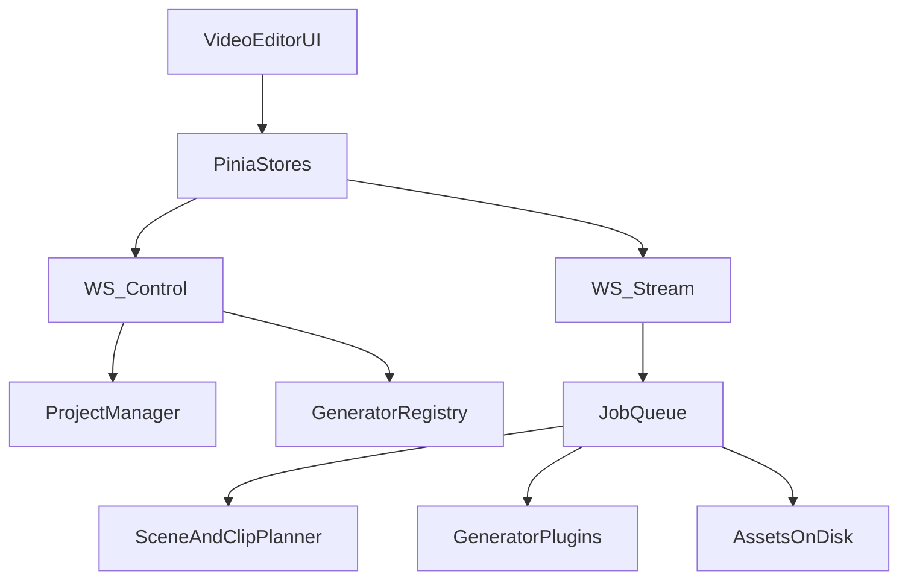

# VideoEditor rebuild plan (generator-driven, local-first)

## Scope / non-goals

- **In scope**: Rebuild only the VideoEditor app and its server-side companion under `server/apps/video_editor/` and `client/src/apps/VideoEditor/`.
- **Not in scope**: Any `code_editor` changes.
- **Local-first**: Projects live as folders on the local filesystem (confirmed). Generators execute inside `xeditor-monorepo/server` (confirmed).
- **No backwards compatibility**: We may delete/replace existing VideoEditor components/models as needed.
- **Reality check (Feb 2026)**: Some open-source models can generate **audio+video together** (e.g. LTX‑2). Our generator system must treat audio and video as **co-generated artifacts**, not always separate jobs.

## Current foundation we can reuse (and where it falls short)

- **Good bones already exist**:
  - Generator base classes + capability filtering exist in `[server/apps/video_editor/generators/base.py](/home/gowrav/Development/xeditor-monorepo/server/apps/video_editor/generators/base.py)`.
  - Project folder persistence exists in `[server/apps/video_editor/project.py](/home/gowrav/Development/xeditor-monorepo/server/apps/video_editor/project.py)`.
  - VRAM-aware single-GPU job queue + progress streaming exists in `[server/apps/video_editor/jobs/queue.py](/home/gowrav/Development/xeditor-monorepo/server/apps/video_editor/jobs/queue.py)`.
  - Client has a stable WS pattern + stores + layout scaffold in `client/src/apps/VideoEditor/`.
- **But to meet your requirements**, we must redesign:
  - **Generator contract**: currently capabilities exist, but there is **no typed “UI parameter schema”** for generator-specific user inputs.
  - **Asset import/recording**: no HTTP file upload endpoints exist yet (only WS RPC).
  - **Scene/clip planning**: current timeline is “clip-first”; you need **audio-first planning** with automatic splitting into multiple video clips per scene.
  - **Character designer**: needs first-class directory layout and generator-aware pose generation.

## Vocabulary (single source of truth)

- **Generator**: A plugin class implementing a strict base interface (LLM/TTS/T2I/I2V/T2V/Music/SFX/LipSync/Upscale/**AudioVideo**). It declares: capabilities + UI parameters + IO requirements.
- **Project**: Folder containing JSON state + assets.
- **Asset**: A file (image/audio/video) plus metadata; stored under project assets, referenced by stable IDs.
- **Scene**: Narrative unit (script + prompts + cast/props). Editable, reorderable.
- **Clip**: Timeline unit on a track (video/audio/overlay). A scene expands to multiple clips.
- **SceneInstance (group)**: A timeline grouping object that binds scene video+audio clips together for moving/resizing as a unit.

## Target architecture (high-level)

## 1) Generator system redesign (extensible, drop-in)

### 1.1 Expand `GeneratorCapabilities` into “Capabilities + UI schema + IO schema”

Today capabilities live in `[server/apps/video_editor/models.py](/home/gowrav/Development/xeditor-monorepo/server/apps/video_editor/models.py)` (`GeneratorCapabilities`, `GeneratorConfig`) and the base classes in `[server/apps/video_editor/generators/base.py](/home/gowrav/Development/xeditor-monorepo/server/apps/video_editor/generators/base.py)`.

We will add models to support everything you described:

- **Model family & LoRA policy**: `model_family`, `base_model_family`, `allowed_lora_families`, `supports_lora`, `max_loras`, etc.
- **Subjects policy**: `accepts_characters_count` and `accepts_products_count` (with `0` meaning “not supported”).
- **Recommended/best sizes**: `best_resolutions`, `max_resolutions`, divisibility rules.
- **Hard limits**: `max_duration_seconds`, `max_generation_seconds`, `max_audio_seconds`, `max_frames`.
- **Feature flags**:
  - Video: `supports_control_video`, `supported_control_types` (pose/depth/canny/…)
  - Audio: `supports_voice_cloning`, `supports_music`, `supports_sfx`, `supports_effects`
  - LipSync: `supports_lipsync`, `supports_talking_head`
- **UI parameter schema (critical)**: add `ui_schema` describing generator-specific inputs.
- **Shape constraints (critical)**: add a structured way to declare hard constraints like:
  - resolution divisibility (e.g. divisible by 8/16/32)
  - frame-count rules (e.g. LTX‑2 requires `num_frames` divisible by 8 + 1)
  - supported FPS ranges
  - max duration/frames per checkpoint/quality mode

Proposed UI schema shape (server + mirrored TS types):

- `GeneratorUiSchema`:
  - `sections[]` (e.g. Prompt, Quality, LoRA, Seed, Control, Output)
  - `fields[]` (each field has: `key`, `label`, `type`, `default`, `required`, constraints, plus `ui` hints)
  - Field types: `string`, `text`, `int`, `float`, `bool`, `select`, `multiselect`, `assetRef(image|video|audio)`, `assetRefs(character|prop|product)`, `json`

This makes generator UIs **auto-rendered** (the generator designer decides which knobs appear).

### 1.2 Built-in vs custom generators

- Built-ins: registered in `[server/apps/video_editor/routes.py](/home/gowrav/Development/xeditor-monorepo/server/apps/video_editor/routes.py)` `init_video_editor()` and **cannot be deleted**.
- Custom generators:
  - Stored under a dedicated folder like `~/.xeditor/video_editor/generators/custom/`.
  - Discovered at runtime (pattern inspired by your `ai-video-generator-editor` repo’s `module_discovery.py` approach).
  - **Add/Delete** from UI:
    - “Add generator” uploads a `.py` file (or a zip) + metadata.
    - “Delete” removes from custom folder and unregisters.
  - Safety: only allow importing from the custom generator root; validate that class inherits the correct base and returns valid capabilities + schema.

### 1.3 Generator execution contract (uniform IO)

We keep the async pattern already present in `[server/apps/video_editor/generators/base.py](/home/gowrav/Development/xeditor-monorepo/server/apps/video_editor/generators/base.py)` (load/unload + progress callback), but we standardize outputs:

- Every generator returns a **typed `GenerationResult**` with:
  - `artifact_paths[]`
  - `metadata` (seed, steps, cfg, model_id, loras used, etc)
  - `duration_seconds`, `width`, `height`, `fps`, `frame_count` as applicable

#### 1.3.1 Joint audio+video generators (new)

Modern generators may produce **audio+video together**. For example, **LTX‑2** is an audio-video foundation model and has hard shape constraints like “width/height divisible by 32” and “frame count divisible by 8 + 1” per the model card ([HF LTX‑2](https://huggingface.co/Lightricks/LTX-2)).

To support this cleanly, we will add:

- A dedicated generator type (capability + base class) for **AudioVideo generation**, e.g. `generator_type: 'av'` (name TBD) or a capability flag `produces_audio: true` + `produces_video: true`.
- A result type that explicitly returns both artifacts:
  - `video_artifact_path` (or `artifact_paths` + typed roles)
  - `audio_artifact_path`
  - shared metadata (fps, num_frames, sample_rate, duration_seconds)

Timeline behavior:

- If a clip is generated by an A/V generator, we **auto-create/attach** an audio clip in the corresponding scene instance (or allow the user to choose between “use generator audio” vs “use TTS/dialog audio” vs “mix”).

Validation behavior:

- The properties panel will enforce the generator’s shape constraints (divisibility rules, valid `num_frames`, etc.) before dispatching jobs.

#### 1.3.2 Environment isolation + license acknowledgement (practical requirement)

Some generators require very specific CUDA/PyTorch stacks (LTX‑2 references Python ≥ 3.12, CUDA > 12.7, PyTorch ~ 2.7 on its model card ([HF LTX‑2](https://huggingface.co/Lightricks/LTX-2))). To avoid destabilizing the main server environment, we plan for:

- A per-generator “runtime” option: run inside an isolated `uv` environment and/or a worker subprocess.
- A per-generator “license” field surfaced in UI; for models like LTX‑2 (community license), we require user acknowledgement before download/install.

### 1.4 Shared “Model download / install” support (HF/Civitai URLs)

To support “provide HF/Civitai URL to download and use”, add:

- A server-side `ModelManager` (new module under `server/apps/video_editor/models/` or `server/apps/video_editor/model_manager.py`) that:
  - Downloads to `~/.xeditor/video_editor/models/` with checksums + resumable downloads when possible.
  - Emits job progress events (reusing the existing stream WS progress pattern).
- Generators can declare `installables[]` in capabilities (URLs + expected files + license hints).

## 2) Project format & on-disk structure

Keep the existing project root marker + internal folder approach from `[server/apps/video_editor/project.py](/home/gowrav/Development/xeditor-monorepo/server/apps/video_editor/project.py)`, but evolve it:

- `xeditor.video.project.json` remains the “openable marker”.
- `xeditor.video/project.json` is the single source of truth.
- Asset layout extensions:
  - `assets/characters/{character_name}/` (requested)
  - `assets/characters/{character_name}/{role}.{ext}` for canonical role images
  - `assets/control_videos/` for pose/motion inputs
  - `assets/products/` (if you want products distinct from props)

## 3) Scene→clip planning (audio-first) and timeline model changes

### 3.1 Add SceneInstance grouping + clip linking

Add to the models (server + client types):

- `scene_instances[]` (or `timeline.groups[]`) each with:
  - `id`, `scene_id`, `start_time`, `duration`
  - `video_clip_ids[]`, `audio_clip_ids[]`
  - `locked_move` (move together)
- Add `group_id` onto `TimelineClip`.

### 3.2 Audio-first pipeline algorithm

We implement a deterministic “planner” used after audio generation (or after A/V generation when audio is co-produced):

1. For each scene instance, compute total audio duration from its dialog/narration audio clips.
2. Pick video generator (default or per-scene override).
3. Let `maxClip = generator.capabilities.max_duration_seconds`.
4. Split the scene into `N = ceil(audioDuration / maxClip)` video clips.
5. Assign durations so that the sum equals audio duration (last clip shorter).
6. Set continuity:

- For clip k>0, set `generation_spec.link_first_frame_from = {clip_id: prevClip, frame: 'last'}`.

1. Mark all generated video artifacts for that scene as stale if anything upstream changes.

This directly satisfies your “audio first, then multiple videos per scene” requirement.

### 3.3 Staleness & regeneration semantics

We keep and strengthen the existing stale logic (already present as `audio_generated_at`, `video_generated_at`, and the helpers in TS types).

- Any edit to script/audio settings invalidates downstream video clips.
- Any edit to prompts/LoRA/control invalidates that clip’s video.

## 4) Jobs: clear, extensible job graph with progress

We will evolve the existing job queue in `[server/apps/video_editor/jobs/queue.py](/home/gowrav/Development/xeditor-monorepo/server/apps/video_editor/jobs/queue.py)` into explicit **job graphs** per operation:

- **ScriptGenerator job**: produces story scenes + optional timeline insertion.
- **Audio job**: produces WAV per dialog/narration line; updates durations.
- **Planner job**: updates timeline clip layout (split/extend).
- **Image job**: keyframes for each video clip.
- **Video job**: generates clip videos.
- **AudioVideo job** (new): generates a clip’s **video+audio together** and places both artifacts on the timeline (with user-selectable audio usage/mix policy).
- **LipSync job** (new): takes video clip + audio clip + face ref; outputs lipsynced clip.
- **Export job**: uses FFmpeg to merge tracks (the merge logic already exists).

### 4.1 VRAM-aware scheduling

- Preserve current single heavy-job GPU lock design.
- Extend VRAM calculation: set `job.vram_gb_required` from the chosen generator’s capabilities (instead of the current placeholder).

### 4.2 Progress + preview

- Keep using stream WS `/video-editor/ws/ve/stream`.
- Standardize progress stages per job type (so UI can show consistent status bars).

## 5) API surface (what we add)

### 5.1 Keep WS control/stream split

Already in `[server/apps/video_editor/routes.py](/home/gowrav/Development/xeditor-monorepo/server/apps/video_editor/routes.py)`.

### 5.2 Add HTTP endpoints for assets (missing today)

Because uploading/recording assets over WS is awkward, add HTTP endpoints under the same router:

- `POST /video-editor/assets/upload` (multipart): upload into a project asset subfolder; returns `AssetRef` + metadata.
- `GET /video-editor/assets/file` (safe path by asset id): stream file for preview/player.
- `GET /video-editor/assets/thumb` (optional): server-side thumbnail generation/caching.

### 5.3 Add WS RPC for custom generators

New control RPC messages:

- `ve_custom_generators_list`
- `ve_custom_generators_add` (metadata + upload token)
- `ve_custom_generators_remove`
- `ve_generators_reload`

## 6) UI rebuild: Adobe Premiere-style workspace + generator panels

We keep the current 4-panel structure (left assets, center player, bottom timeline, right properties) already scaffolded in `client/src/apps/VideoEditor/layouts/VideoEditorLayout.vue` and components.

### 6.1 Core screens

- **Project Wizard**: create/open project with fields: name/description/genre/VRAM target/canvas preset.
- **Main workspace**:
  - Left: Asset panel (tabs: Images, Audio, Video, Characters, Props/Products, ControlVideos)
  - Center: Player (preview selected clip / scene instance / full timeline)
  - Bottom: Multi-layer timeline (video + audio + bg music + sfx + overlays) ( full screen width )
  - Right: Dynamic properties panel (renders generator UI schema for selected clip/scene/asset)
  - Bottom status bar: Job queue + progress + cancel

### 6.2 Generator components (requested)

Implement each as a focused component that consumes `GeneratorUiSchema`:

- Image Generator Panel
- Video Generator Panel (supports control video selection + webcam recording → upload)
- Character Designer Panel (pose/angle batch generation + directory layout)
- Audio Generator Panel (TTS/music/sfx)
- Script Generator Panel (inserts scenes at cursor/end; produces timeline JSON)
- Scene Edit Panel (edit one scene instance; invalidates downstream assets)
- Export Panel

### 6.3 Timeline UX

- Scene instances appear as “chunks” on the main video track; expand/collapse to reveal sub-clips.
- Double-click opens Scene Edit Panel.
- When trimming duration: prompt to “ripple” subsequent items or not.
- Toggle between “Script view” and “Video view” (already exists conceptually; we’ll formalize).

## 7) Feb 2026 open-source model landscape → what to design for

(We design the generator plugin interface so these can be swapped in/out.)

- **Video generation** (consumer GPU relevant):
  - LTX‑2 (audio+video joint generation; strict shape constraints per model card ([HF LTX‑2](https://huggingface.co/Lightricks/LTX-2)))
  - LTX-Video (fast; can run with lower VRAM at reduced settings)
  - CogVideoX (2B/5B variants; quantized runs around ~16GB VRAM for larger variants)
  - HunyuanVideo (very strong but heavier; FP8/quant helps; ~16–24GB typical)
  - Wan 2.1 (efficient; ~12GB-class variants exist)
- **Lip sync / talking head**:
  - MuseTalk (real-time lip sync; strong baseline)
  - LatentSync (quality + temporal stability focus)
  - Wav2Lip (classic baseline; still useful)

This implies our generator IO schema must handle:

- `face_ref` image/video, `audio_ref`, and optionally `mask/roi` settings
- deterministic durations aligned to audio
- **co-generated audio+video** outputs (placing both on the timeline and export graph)

## 8) Implementation strategy (phased, testable)

- **Phase A — Data model + contracts**
  - Add/replace models in `server/apps/video_editor/models.py` and mirrored TS types in `client/src/apps/VideoEditor/types/index.ts`.
  - Add `GeneratorUiSchema` + extended capabilities.
- **Phase B — Generator registry + custom generator management**
  - Add plugin discovery + safe load/unload; add RPC to manage custom generators.
- **Phase C — Asset HTTP APIs**
  - Implement upload/serve endpoints; update UI asset manager + webcam recorder.
- **Phase D — Scene planner + timeline grouping**
  - Add scene instance groups + audio-first split planner.
- **Phase E — Job graph rewrite**
  - Refactor job implementations to use the new models and generator schema; add lip-sync job type.
- **Phase F — UI rebuild**
  - Replace current tab-style editors with the single “Premiere workspace” with docked panels.
  - Implement generator panels that auto-render from schemas.
- **Phase G — Export and polish**
  - Improve FFmpeg merge to support multiple tracks (dialog/music/sfx), not just delayed mixes.

## Key files we will change

- Frontend:
  - `client/src/apps/VideoEditor/layouts/VideoEditorLayout.vue`
  - `client/src/apps/VideoEditor/components/*` (major rebuild of Timeline/Properties/Asset panels)
  - `client/src/apps/VideoEditor/stores/videoProject.ts`
  - `client/src/apps/VideoEditor/stores/videoJobs.ts`
  - `client/src/apps/VideoEditor/types/index.ts`
- Backend:
  - `server/apps/video_editor/models.py`
  - `server/apps/video_editor/generators/base.py`
  - `server/apps/video_editor/routes.py`
  - `server/apps/video_editor/project.py`
  - `server/apps/video_editor/jobs/queue.py`
  - New: `server/apps/video_editor/generators/discovery.py`, `server/apps/video_editor/assets/routes.py` (or similar)
