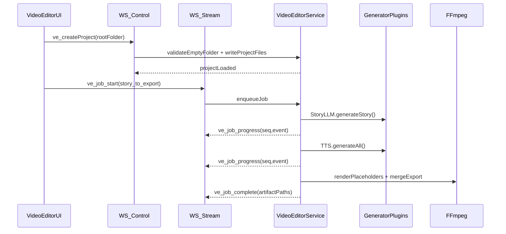
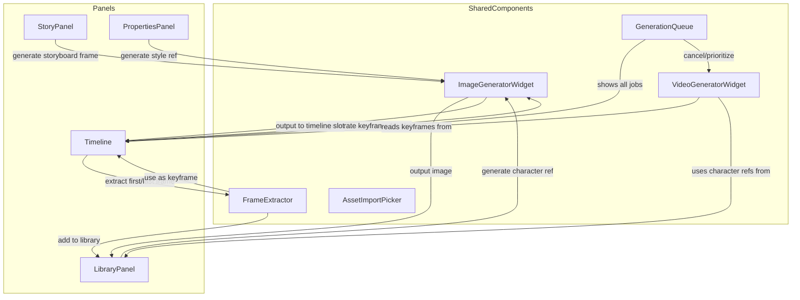

# Video Editor (V1) Plan — Local Companion + Extensible Generators

## Goals (V1)

- Create/open a **project in a user-selected empty folder**, writing a **project file inside that folder** so it can be reopened later.
- Provide an **end-to-end simple** pipeline:
  - Story designer (LLM) → per-scene script JSON
  - Generate TTS audio for scenes (voice sample optional)
  - Generate **placeholder video** per scene (slideshow/color/video template + captions) aligned to audio duration
  - Merge scenes into final export (MP4)
- Make the system **extensible**: new generators can be dropped in and become selectable; per-step model/config can be overridden.
- Keep it **performant**: heavy work in the local companion; browser focuses on responsive UI, preview, and timeline.

## Key constraints & reuse

- **Reuse existing Local Companion dual-WebSocket pattern**.
  - Client already maintains separate stream/control sockets:

```35:57:/home/gowrav/Development/xeditor-monorepo/client/src/stores/localCompanion.ts
  // Dual WebSocket connections
  // Stream: handles chat_message, llm_stream_request_v2, cancel, stream_resume
  // Control: handles all other RPC operations and receives file_changed events
  let streamWs: WebSocket | null = null;
  let controlWs: WebSocket | null = null;

  const streamWsUrl = computed(() => `ws://localhost:${port.value}/ws/stream`);
  const controlWsUrl = computed(() => `ws://localhost:${port.value}/ws/control`);
```

- Server already distinguishes message types per endpoint:

```121:124:/home/gowrav/Development/xeditor-monorepo/server/apps/code_editor/routes.py
# Message types that should be handled on the stream WebSocket (not control)
STREAM_MESSAGE_TYPES = {"chat_message", "llm_stream_request_v2", "cancel", "stream_resume"}
```

- VideoEditor app stubs already exist:
  - `[client/src/apps/VideoEditor/pages/VideoEditorPage.vue](/home/gowrav/Development/xeditor-monorepo/client/src/apps/VideoEditor/pages/VideoEditorPage.vue)`
  - `[client/src/apps/VideoEditor/layouts/VideoEditorLayout.vue](/home/gowrav/Development/xeditor-monorepo/client/src/apps/VideoEditor/layouts/VideoEditorLayout.vue)`
  - `[server/apps/video_editor/endpoints.py](/home/gowrav/Development/xeditor-monorepo/server/apps/video_editor/endpoints.py)`
- For generation modularity, reuse the POC’s “capabilities + module discovery” idea (but implemented inside this monorepo and integrated with websocket streaming).

## Architecture (V1)

### Project-on-disk format (in the selected folder)

- Create a single “openable” project file at the folder root, e.g. `xeditor.video.project.json`.
- Keep all editor-managed assets/state in a dedicated subdir to avoid clutter:
  - `xeditor.video/`
    - `project.json` (authoritative state)
    - `assets/`
      - `characters/` (images)
      - `props/` (images)
      - `voices/` (speaker samples)
      - `audio/` (generated TTS)
      - `video/` (scene clips, placeholders)
    - `story/` (story designer outputs)
    - `renders/` (final exports)
    - `cache/` (optional)

**Why two files?** The root file is the stable “open project” entrypoint; `xeditor.video/project.json` is the evolving state with more detail.

### State model (JSON)

- `project.settings`:
  - `vramTargetGb` (user picks; drives generator eligibility + concurrency)
  - `canvas` preset/custom: width/height, orientation, fps
  - default model selections for: `storyLLM`, `tts`, `placeholderVideo`, later `t2v/i2v`, `music`, `sr/upscaler`
- `library`:
  - `characters[]` with `{id, name, code, imagePath, voiceSamplePath?}`
  - `props[]` with `{id, name, code, imagePath}`
- `story`:
  - structured scenes: `{sceneId, narrationText, visualPrompt, cameraNotes, castIds[]}`
- `timeline` (minimal for V1): ordered scene items with derived durations (from audio)
- `jobs`: job records and artifact paths

### Generation pipeline (V1)

- **Story → TTS → Placeholder video → Merge**
- Placeholder clip generation uses ffmpeg templates (fast, deterministic):
  - solid background + captions + optional character image overlay
  - duration = audio duration

### Streaming & concurrency

- Use **control** socket for project CRUD, listing/discovery, reading state.
- Use **stream** socket for long-running jobs (story generation, TTS, render/export) to avoid interference.
- Implement a **VideoJob** runner with:
  - per-job ID
  - event stream with sequence numbers (compatible with existing resume patterns)
  - cancellation
  - a global per-GPU queue (default concurrency 1) honoring `vramTargetGb`.

### Where to use WASM

- V1: keep WASM optional.
  - Browser preview: rely on **WebAudio + native video playback**.
  - Keep export in local companion (native ffmpeg) for speed/quality.
- Later: use WASM/WebCodecs for client-side transforms or lightweight exports (e.g. quick preview renders). For MP4 muxing in-browser, plan to use WebCodecs + a muxer library (e.g. Mediabunny) if/when browser export is needed.

### Model ecosystem considerations (Feb 2026)

- Video generation candidates (local 4090): **Wan 2.1**, **HunyuanVideo 1.5**, **CogVideoX** via ComfyUI/diffusers pipelines; support quantized variants when needed.
- Voice/TTS/voice cloning candidates: **XTTS v2**, **F5-TTS**, **StyleTTS2**, **RVC**-style voice conversion.
- Music/SFX (optional later): **AudioCraft/MusicGen** (note licensing constraints).

## Dataflow diagram




## Files/modules to add or extend

### Server (local companion)

- Extend `[server/apps/video_editor/](/home/gowrav/Development/xeditor-monorepo/server/apps/video_editor/)` into a real app:
  - `project_manager.py`: create/open/save project in user folder, validate “empty folder” rule
  - `models.py`: Pydantic models for project state, library items, timeline, job state
  - `generators/`:
    - `base.py`: typed generator interfaces + `Capabilities`/`ConfigSchema`
    - `discovery.py`: plugin discovery (filesystem scanning or explicit registry)
    - `impl/placeholder_ffmpeg.py`: placeholder video generator (V1)
    - `impl/tts_*.py`: initial TTS plugin(s) (start with a simple local one or wrap an existing service)
    - `impl/story_llm_provider_bridge.py`: bridge to existing provider system (reuse code_editor provider stack)
  - `jobs/`:
    - `queue.py`: VRAM-aware queue + cancellation
    - `streaming.py`: emit progress events with seq numbers
  - `rpc.py` or `routes.py`: add control RPC handlers (`ve_*`) and stream handlers (`ve_job_*`).

### Client (Vue/Quasar)

- Build out `[client/src/apps/VideoEditor/](/home/gowrav/Development/xeditor-monorepo/client/src/apps/VideoEditor/)`:
  - `stores/videoProject.ts`: project state, open/close, recent projects
  - `stores/videoJobs.ts`: job lifecycle + progress event ingestion
  - `components/`:
    - `ProjectWizard.vue`: pick folder + set VRAM target + canvas preset
    - `LibraryPanel.vue`: characters/props/voices (file upload UI)
    - `StoryDesigner.vue`: prompt + structured story editor
    - `TimelineSimple.vue`: ordered scenes + durations
    - `ExportPanel.vue`: start job + progress + download/open output
- Reuse existing folder picker pattern from CodeEditor (`FolderPickerDialog.vue`) for selecting the project folder.

## Implementation steps (high level)

1. **Project system**: create/open project in chosen folder, write root project file + internal state dir; maintain a recents list in local companion.
2. **Generator plugin contract**: capabilities (VRAM min, formats, supported outputs), config schemas, and discovery.
3. **Job queue + streaming**: add `ve_job_start/cancel/resume` on stream socket with progress events; keep CRUD on control socket.
4. **V1 generators**:
  - Story LLM generator (bridge to existing provider presets/models)
  - TTS generator (start with one supported option; store durations)
  - Placeholder video generator (ffmpeg templates)
  - Final merge/export (ffmpeg)
5. **UI**:
  - Wizard → story designer → run generation → preview scene clips → export final
6. **Hardening**:
  - VRAM budgeting + single-job GPU lock
  - crash-safe state writes (atomic write to JSON)
  - resumable jobs via persisted job state

## Acceptance criteria for V1

- Create a project in an empty folder and reopen it later via the project file.
- Generate a multi-scene script, per-scene TTS audio, per-scene placeholder video aligned to audio, and a final merged MP4.
- Progress UI updates in real time without disrupting other operations.
- Generators are discoverable and selectable via capabilities; per-step settings can override defaults.

---

# Advanced Capabilities (V2+ Roadmap, but architect for now)

The following features require forward-thinking architecture in V1 so they can be added incrementally.

## 1. Temporal Continuity & Keyframe Chaining

### Last-frame to I2V pipeline

- When generating clip N+1, system can auto-extract last frame of clip N and use as I2V input.
- Timeline data model includes `linkFirstFrameFrom: ClipRef` to express this dependency.
- Job scheduler resolves dependencies: clip N must complete before clip N+1 starts.

### First + Last frame (FLF) interpolation

- Some models (Wan 2.1, future CogVideoX variants) accept both start and end keyframes.
- User places two keyframe images; system generates smooth transition video between them.
- Generator capability flag: `supportsFLFMode: boolean`.

### Keyframe injection anywhere

- User can generate or upload an image at any timeline position.
- System generates video segments that "flow into" and "out of" that keyframe.
- Enables precise creative control over key moments.

## 2. On-Demand Image Generation (Anywhere in UI)

### ImageGeneratorWidget (reusable component)

A self-contained component that can be invoked from:

- Story panel (generate storyboard frame for a scene)
- Library panel (generate character reference)
- Timeline (generate keyframe for a slot)
- Properties panel (generate style reference)

Inputs:

- Prompt (or inherit from context)
- Reference images (optional: style, character, pose)
- Quality mode: "preview" (fast, low-res) vs. "final" (slow, high-res)
- Target destination: library, timeline slot, or download

Outputs:

- Generated image as AssetRef
- Optionally auto-insert into timeline or library

### Quick preview vs. final quality

- Preview mode: use fast T2I settings (fewer steps, lower res) for rapid iteration.
- Final mode: full quality, may queue behind other jobs.
- UI shows preview thumbnail immediately; user can upgrade to final.

## 3. Enhanced Timeline Data Model

```
TimelineClip {
  id: string
  trackId: string          // multi-track support
  startTime: number
  duration: number
  
  // Content source
  sourceType: 'generated_video' | 'generated_image' | 'imported' | 'placeholder' | 'audio'
  
  // Generation spec (for video/image clips)
  generationSpec?: {
    mode: 'prompt_only' | 'i2v' | 'flf' | 't2v'
    prompt?: string
    negativePrompt?: string
    motionPrompt?: string
    
    // Keyframe references
    firstFrame?: AssetRef   // For I2V start or FLF start
    lastFrame?: AssetRef    // For FLF end
    
    // Continuity linking (resolved at job time)
    linkFirstFrameFrom?: ClipRef  // "use last frame of clip X"
    linkLastFrameTo?: ClipRef     // "my last frame feeds clip Y"
    
    // Style/character injection
    styleRef?: AssetRef
    characterRefs?: AssetRef[]    // For IP-adapter
    
    // Model override
    generatorId?: string
    generatorConfig?: Record<string, unknown>
  }
  
  // State
  status: 'draft' | 'keyframe_ready' | 'queued' | 'generating' | 'done' | 'error'
  keyframePath?: string    // Generated/uploaded keyframe image
  artifactPath?: string    // Final video/audio artifact
  previewPath?: string     // Low-res preview (generated early)
}
```

## 4. Expanded Generator Capabilities Contract

```python
class GeneratorCapabilities(BaseModel):
    # Existing
    title: str
    vram_gb_min: float
    ram_gb_min: float
    supported_formats: List[str]  # ["Portrait", "Landscape", "Square"]
    supports_ip_adapter: bool
    supports_lora: bool
    max_subjects: int
    accepts_text_prompt: bool
    accepts_negative_prompt: bool
    
    # New for advanced modes
    supports_i2v: bool = False           # Image-to-video
    supports_t2v: bool = False           # Text-to-video (no image input)
    supports_flf: bool = False           # First+last frame interpolation
    supports_preview_mode: bool = False  # Fast low-quality generation
    supports_camera_control: bool = False
    supported_control_nets: List[str] = []  # ["depth", "pose", "canny"]
    
    # Resolution constraints
    valid_resolutions: List[Tuple[int, int]] = []
    resolution_must_be_divisible_by: int = 8
    max_frames: int = 120
    max_duration_seconds: float = 5.0
```

## 5. Reusable UI Component Architecture




### Key Components


| Component              | Responsibility                                                                  |
| ---------------------- | ------------------------------------------------------------------------------- |
| `ImageGeneratorWidget` | Prompt input, ref selector, quality toggle, generate button; emits image result |
| `VideoGeneratorWidget` | Wraps video gen job; source mode selector (prompt/I2V/FLF); shows progress      |
| `FrameExtractor`       | Extract frame(s) from video at specified time(s); output as library assets      |
| `AssetSlot`            | Drag-drop target for images/videos; can trigger generation in-place             |
| `GenerationQueue`      | Global job list with progress, priority, cancel; persists across panels         |
| `ContinuityOverlay`    | Timeline overlay showing frame linkages between clips                           |
| `KeyframeEditor`       | Inline image editor for adjusting/regenerating keyframes                        |


## 6. Advanced Generation Workflows

### Workflow A: User-driven keyframe iteration

1. User adds clip to timeline, enters prompt.
2. Clicks "Generate Keyframe" → quick T2I preview appears.
3. Can regenerate with tweaked prompt until satisfied.
4. Clicks "Generate Video" → I2V from keyframe.
5. If keyframe changes, video is auto-invalidated and re-queued.

### Workflow B: Auto-continuity chain

1. User enables "Link to previous" toggle on clip B.
2. When clip A's video completes, system extracts last frame.
3. Clip B's I2V job auto-starts using that frame.
4. Progress events: "Waiting for clip A" → "Extracting frame" → "Generating video".

### Workflow C: FLF interpolation

1. User places keyframe image at timeline position T1.
2. Places another keyframe at position T2.
3. Selects "FLF Interpolation" for the gap.
4. System calls FLF-capable generator with both images + duration.
5. Result fills gap with smooth transition video.

### Workflow D: Style-consistent batch generation

1. User uploads a "style reference" image to library.
2. Enables "Apply style to all clips" in project settings.
3. All T2I/I2V generations include that style reference.
4. Characters + style are combined via multi-reference IP-adapter.

## 7. Post-Processing Pipeline (V2+)

- **Super-resolution**: Upscale generated clips (Real-ESRGAN, etc.)
- **Frame interpolation**: Increase framerate (RIFE, etc.)
- **Color grading**: Apply LUTs or AI color matching
- **Face restoration**: Enhance faces in human characters (GFPGAN, CodeFormer)
- **Audio mixing**: Layer background music, SFX, voice with crossfades

Each is a generator with its own capabilities; user can enable/disable per-project or per-clip.

## 8. Streaming Progress Enhancements

```python
class JobProgressEvent(BaseModel):
    job_id: str
    seq: int                       # For resumption
    stage: str                     # 'extracting_frame', 'generating_keyframe', 'generating_video', 'post_processing'
    stage_progress: float          # 0.0 - 1.0
    overall_progress: float        # 0.0 - 1.0
    current_frame: Optional[int]
    total_frames: Optional[int]
    preview_url: Optional[str]     # Progressive preview as generation happens
    eta_seconds: Optional[float]
    message: Optional[str]
```

Preview URLs allow UI to show partial results during long generations (some models emit intermediate frames).

## 9. Incremental Regeneration (Edit Any Clip On-the-Fly)

A core creative workflow: user edits dialog/script for a clip and regenerates just that portion without re-rendering the entire project.

### Per-Clip Script Model

```python
class ScriptLine(BaseModel):
    character_id: Optional[str] = None  # Who speaks (None = narrator)
    text: str
    emotion_hint: Optional[str] = None  # "happy", "angry", "whisper"
    voice_override: Optional[str] = None  # Use different voice for this line

class ClipScript(BaseModel):
    lines: List[ScriptLine] = []
```

### Staleness Tracking

Each clip tracks timestamps for when content was edited vs. when artifacts were generated:

```python
class TimelineClip(BaseModel):
    # ... existing fields ...
    
    # Script content
    script: Optional[ClipScript] = None
    
    # Timestamps for staleness detection
    script_edited_at: Optional[float] = None
    keyframe_edited_at: Optional[float] = None
    style_edited_at: Optional[float] = None
    audio_generated_at: Optional[float] = None
    video_generated_at: Optional[float] = None
    
    # Computed staleness
    @property
    def is_audio_stale(self) -> bool:
        if self.audio_generated_at is None:
            return True
        return (self.script_edited_at or 0) > self.audio_generated_at
    
    @property
    def is_video_stale(self) -> bool:
        if self.video_generated_at is None:
            return True
        if self.is_audio_stale:
            return True  # Audio changes cascade to video
        return max(self.keyframe_edited_at or 0, self.style_edited_at or 0) > self.video_generated_at
```

### Dependency Cascade Rules

When user edits a clip, the system marks downstream dependencies stale:


| Edit Type                            | Immediate Effect | Cascade Effect                |
| ------------------------------------ | ---------------- | ----------------------------- |
| Dialog text changed                  | Audio stale      | Video stale (if audio-synced) |
| Keyframe changed                     | Video stale      | Next clip stale (if linked)   |
| Character ref changed                | Video stale      | —                             |
| Style ref changed                    | Video stale      | —                             |
| Audio regenerated (duration changed) | —                | Video stale; timeline reflow  |
| Video regenerated                    | —                | Next clip stale (if linked)   |


### Regeneration Modes


| Mode                | Scope                             | Use Case                  |
| ------------------- | --------------------------------- | ------------------------- |
| `preview_audio`     | Fast TTS, stream to UI            | Check dialog sounds right |
| `regen_audio`       | Full quality TTS                  | Update audio only         |
| `regen_video`       | Video from current keyframe       | Keyframe/style changed    |
| `regen_audio_video` | TTS → Video                       | Dialog changed, need both |
| `regen_chain`       | This clip + all linked downstream | Continuity chain update   |
| `regen_all_stale`   | All clips with any staleness      | Before final export       |


### Duration Change Handling

When TTS produces audio with different duration than before:

- **< 0.5s difference**: Offer to time-stretch video (no AI regen)
- **0.5-2s difference**: Ask user: stretch, trim, or regenerate video?
- **> 2s difference**: Recommend video regeneration; warn about timeline reflow

Timeline reflow: if clip duration changes, subsequent clips shift. System can auto-shift or ask user.

### UI Components


| Component              | Purpose                                                             |
| ---------------------- | ------------------------------------------------------------------- |
| `ScriptEditor`         | Inline dialog editor with character picker, emotion selector        |
| `StaleIndicator`       | Badge on clip: orange = audio stale, red = video stale              |
| `RegenerationMenu`     | Right-click menu: Preview / Regen Audio / Regen Video / Regen Chain |
| `DurationChangeDialog` | Popup when audio duration changes significantly                     |
| `BatchRegeneratePanel` | List all stale clips, "Regenerate All" button with queue progress   |


### Workflow Example

1. User selects clip 5 in timeline
2. Properties panel shows script editor
3. User changes dialog text → `script_edited_at` updated → clip shows "audio stale" indicator
4. User clicks "Preview Audio" → fast TTS plays in UI
5. User satisfied → clicks "Regenerate Audio"
6. Job runs, audio artifact updated, `audio_generated_at` set
7. If new duration differs, dialog pops: "Audio is now 4.2s (was 3.8s). Regenerate video?"
8. User confirms → video job queued
9. If clip 6 has `linkFirstFrameFrom: clip-5`, it's marked stale too
10. User can click "Regenerate Chain" to update clip 6 automatically

## 10. Architecture Decisions for Future-Proofing

### Decouple timeline from generation

- Timeline is pure data (clips, positions, durations, refs).
- Generation is a separate job graph that reads timeline + produces artifacts.
- This allows: regenerate one clip without touching timeline; preview with placeholders; batch regenerate.

### Asset library as single source of truth

- All images/videos/audio are stored in library with stable IDs.
- Timeline clips reference library assets, not file paths.
- Enables: deduplication, easy replacement, drag-drop between projects.

### Generator as stateless service

- Generators receive inputs, produce outputs, clear VRAM.
- No internal state between calls.
- Job queue handles sequencing, retries, cancellation.

### Event-sourced job history (optional)

- Store all job events (start, progress, complete, error).
- Enables: job replay, debugging, analytics, undo/redo for regenerations.

